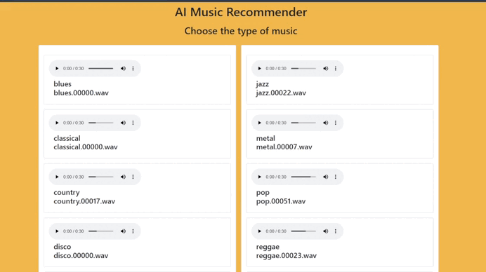

<a id="readme-top"></a>

<br />
<div align="center">
  <a href="https://github.com/github_username/repo_name">
    
  </a>

<h1 align="center">Music Recommender System With FastAPI</h1>
</div>

<details open="open">
<summary>Table of Contents</summary>
<ol>
  <li>
    <a href="#about-the-project">About The Project</a>
    <ul>
      <li><a href="#dataset">Dataset</a></li>
    </ul>
  </li>
  <li>
    <a href="#getting-started">Getting Started</a>
    <ul>
      <li><a href="#clone-the-repository">Clone the repository</a></li>
      <li><a href="#prerequisites">Prerequisites</a></li>
      <li><a href="#how-to-run">How to run</a></li>
    </ul>
  </li>
  <li>
    <a href="#usage">Usage</a>
    <ul>
      <li><a href="#code-guide">Code Guide</a></li>
      <li><a href="#result">Result</a></li>
    </ul>
  </li>
  <li><a href="#contributing">Contributing</a></li>
  <li><a href="#acknowledgments">Acknowledgments</a></li>
  <li><a href="#license">License</a></li>
</ol>
</details>


## About The Project
This project aims to find similarities between songs using Cosine Similarity method, based on already extracted features from audio files like chroma_stft_mean, chroma_stft_var, rms_mean, and more. By analyzing and comparing these features, the system provides recommendations, using the resulting similarity matrix. The project also includes a basic web application with FastAPI employing the mentioned algorithm for accurate song recommendations. It allows users to select music from a small list of music genres and, in turn, provides recommendations according to their choices.

### Dataset
The original dataset is the popularly known GTZAN Dataset provided by <a href = https://webhome.csc.uvic.ca/~gtzan/index.html#>George Tzanetakis</a> and presented in his 2002 paper <a href = https://dspace.library.uvic.ca/server/api/core/bitstreams/d7457cdf-e42f-4772-b9ee-801adf43f949/content>Musical genre classification of audio signals</a> which was a part of his PhD thesis at Princeton University. However, dataset used in this project is a Kaggle reproduction available at this <a href="https://www.kaggle.com/datasets/andradaolteanu/gtzan-dataset-music-genre-classification/data">link</a>.

This dataset, consists of 100 tracks containing 10 different music genres, along with two CSV files comprising the features of each audio, and an image folder containing the visualization for every audio file.

## Getting Started

### Clone the repository
clone the repo with this command in command line :

```sh
git clone https://github.com/Amir-Abed/Music-Recommender-System-With-FastAPI.git
```

### Prerequisites
1- Firstly install the required libraries with the following command :

```sh 
pip install -r requirements.txt 
```
Ensure that all files necessary for ```pip install``` are kept in the root directory.

2- Then download the rquired dataset by following these steps:
1. Refer to <a href="https://www.kaggle.com/datasets/andradaolteanu/gtzan-dataset-music-genre-classification">this link</a> to download it manually.
2. Rename the downloded zip file to ```gtzan-dataset-music-genre-classification.zip```.
3. Create a directory inside the ```satic``` folder and name it ```dataset```. 
4. Extract all contents of ```gtzan-dataset-music-genre-classification.zip``` in to ```dataset``` folder.
5. That's it! Now you can proceed to the <a href="#how-to-run">How to run</a> section.

### How To Run
Run the project with this command:

```sh
fastapi dev model/main.py
```

## Usage

### Code Guide
The file showcase.ipynb provides an explanation and visualization of the code line by line to help understand how the implementation works. Additional methods, including Euclidean distance and Manhattan distance are used in this file to compare their performance with Cosine similarity and to help fammilarize with how they are implemented.

### Result
After running the command in <a href="#how-to-run">How to run</a>, a webpage will open. Then you can check the performance of our model. Just select a song from the list to get recommedations, similar to that song :
<p align="center"> 
  
</p>

## Contributing
You are very welcome to contribute. This helps the community grow and for everyone to learn :) .

Please feel free to open an issue or submit a pull request.

## Acknowledgments
[Andrada](https://www.kaggle.com/andradaolteanu) : For providing the dataset that sereved as the basis of this project.

This project uses code and concepts inspired by the work from [Andrada | Work w/ Audio Data: Visualise, Classify, Recommend](https://www.kaggle.com/code/andradaolteanu/work-w-audio-data-visualise-classify-recommend), licensed under the Apache 2.0 License. 

Modifications were made to:
- Reorganize the code for better workflow integration.
- Expand the functionality of the `find_similar_songs` method.
- Incorporate additional steps for dataset downloading, preparation, and scaling.

## License
[MIT](LICENSE) © Amirreza Abedini

Portions of this project are derived from [Work w/ Audio Data: Visualise, Classify, Recommend](https://www.kaggle.com/code/andradaolteanu/work-w-audio-data-visualise-classify-recommend) and are licensed under the [Apache 2.0](LICENSE) License. See <a href="#acknowledgments">Acknowledgments</a> for more info.
